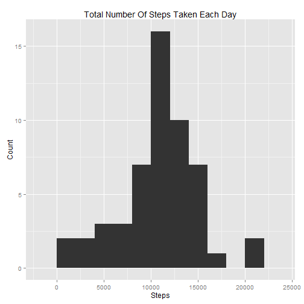
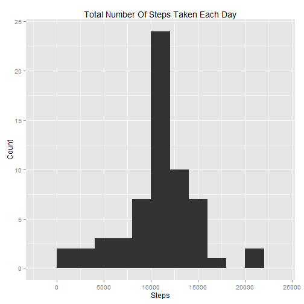

# Reproducible Research: Peer Assessment 1

### Basic settings- Always make code visible

```r
echo = TRUE 
```

## Loading and preprocessing the data

```r
library(knitr)
data <- read.csv("activity.csv")
```

## What is mean total number of steps taken per day?
For this part of the assignment, you can ignore the missing values in the dataset.
1. Calculate the total number of steps taken per day

```r
library(ggplot2)
```

```
## Warning: package 'ggplot2' was built under R version 3.2.2
```

```
## Find out what's changed in ggplot2 with
## news(Version == "1.0.1", package = "ggplot2")
```

```r
totalSteps <- aggregate(steps ~ date, data, FUN = sum, na.rm = TRUE)
```
2. Make a histogram of the total number of steps taken each day

```r
ggplot(data = totalSteps, aes(x = steps)) + geom_histogram(binwidth = 2000) +
     labs(title = "Total Number Of Steps Taken Each Day", x = "Steps", y = "Count")
```

 

3. Calculate and report the mean and median total number of steps taken per day

```r
mean(totalSteps)
```

```
## Warning in mean.default(totalSteps): argument is not numeric or logical:
## returning NA
```

```
## [1] NA
```

```r
median(totalSteps)
```

```
## Error in median.default(totalSteps): need numeric data
```

## What is the average daily activity pattern?
1. Make a time series plot (i.e. type = "l") of the 5-minute interval (x-axis) and the average number of steps taken, averaged across all days (y-axis)

```r
library(ggplot2)
averages <- aggregate(x=list(steps=data$steps), by=list(interval=data$interval),
                      FUN=mean, na.rm=TRUE)
ggplot(data=averages, aes(x=interval, y=steps)) +
    geom_line() +
    xlab("5-minute intervals") +
    ylab("average number of steps taken")+
	title = "Time Series Plot Of The 5-minute Interval"
```

```
## Error in ggplot(data = averages, aes(x = interval, y = steps)) + geom_line() + : could not find function "+<-"
```

2. Which 5-minute interval, on average across all the days in the dataset, contains the maximum number of steps?

```r
averages[which.max(averages$steps),]
```

```
##     interval    steps
## 104      835 206.1698
```

## Imputing missing values

1. Calculate and report the total number of missing values in the dataset (i.e. the total number of rows with NAs)


```r
sum(is.na(data$steps))
```

```
## [1] 2304
```

2. Devise a strategy for filling in all of the missing values in the dataset. The strategy does not need to be sophisticated. For example, you could use the mean/median for that day, or the mean for that 5-minute interval, etc.

The strategy is to create a new dataset which all the missing values are replaced with mean value for that 5-minute
interval.

3. Create a new dataset that is equal to the original dataset but with the missing data filled in.

```r
# Replace each missing value with the mean value of its 5-minute interval
DataNew <- data 
for (i in 1:nrow(DataNew)) {
  if (is.na(DataNew$steps[i])) {
    DataNew$steps[i] <- avgStepByInterval[which(DataNew$interval[i] == avgStepByInterval$interval), "steps"]
  }
}
```

```
## Error: object 'avgStepByInterval' not found
```
4. Make a histogram of the total number of steps taken each day and Calculate and report the mean and median total number of steps taken per day. Do these values differ from the estimates from the first part of the assignment? What is the impact of imputing missing data on the estimates of the total daily number of steps?


```r
totalStepNew <- aggregate(steps ~ date, DataNew, FUN = sum, na.rm = TRUE) 
ggplot(data = totalStepNew, aes(x = steps)) + geom_histogram(binwidth = 2000) +
         labs(title = "Total Number Of Steps Taken Each Day", x = "Steps", y = "Count")
```

 

```r
mean(totalStepNew$steps) 
```

```
## [1] 10766.19
```

```r
median(totalStepNew$steps)
```

```
## [1] 10765
```

The mean and the median are almost the same after replacing missing values with the mean for "5-minute interval". So the median value increased after this strategy of replacing the missing value. Also, the new mean and old mean of total steps taken per day are the same but the new median is greater than old median.

## Are there differences in activity patterns between weekdays and weekends?
1. Create a new factor variable in the dataset with two levels -- "weekday" and "weekend" indicating whether a given date is a weekday or weekend day.


```r
DataNew$weekday <- as.factor(ifelse(weekdays(DataNew$date) %in% c("Saturday", "Sunday"), "Weekend", "Weekday"))
```

```
## Error in UseMethod("weekdays"): no applicable method for 'weekdays' applied to an object of class "factor"
```

2. Make a panel plot containing a time series plot (i.e. type = "l") of the 5-minute interval (x-axis) and the average number of steps taken, averaged across all weekday days or weekend days (y-axis). The plot should look something like the following, which was created using simulated data:

```r
averages <- aggregate(steps ~ interval + day, data=DataNew, mean)
```

```
## Error in eval(expr, envir, enclos): object 'day' not found
```

```r
ggplot(averages, aes(interval, steps)) + geom_line() + facet_grid(day ~ .) +
    xlab("5-minute interval") + ylab("Number of steps")
```

```
## Error in layout_base(data, rows, drop = drop): At least one layer must contain all variables used for facetting
```
